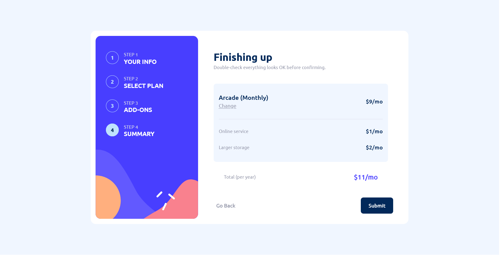
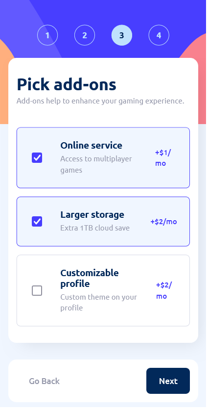

# Frontend Mentor - Multi Step Form solution

This is a solution to the [Todo app challenge on Frontend Mentor](https://www.frontendmentor.io/challenges/multistep-form-YVAnSdqQBJ/hub)

## Table of contents

- [Overview](#overview)
  - [The challenge](#the-challenge)
  - [Screenshot](#screenshot)
  - [Links](#links)
- [My process](#my-process)
  - [Built with](#built-with)
  - [Continued development](#continued-development)
  - [Useful resources](#useful-resources)
- [Author](#author)
- [Acknowledgments](#acknowledgments)

## Overview

### The challenge

Your users should be able to:

- Complete each step of the sequence
- Go back to a previous step to update their selections
- See a summary of their selections on the final step and confirm their order
- View the optimal layout for the interface depending on their device's screen size
- See hover and focus states for all interactive elements on the page
- Receive form validation messages if:
  - A field has been missed
  - The email address is not formatted correctly
  - A step is submitted, but no selection has been made

### Screenshot

  

  

### Links

- Solution URL: [Github Repository : FM-multi-step-form](https://github.com/Lio-n/FM-multi-step-form/)
- Live Site URL: [Vercel](https://fm-multi-step-form-one.vercel.app/)

## My process

### Built with

- Semantic HTML5 markup
- CSS custom properties
- Mobile-first workflow
- [BEM](https://animaticss.com/articulo/que-es-bem-css/) - For transparency and clarity in HTML and CSS structure.
- Typescript
- [Svelte](https://svelte.dev/docs/introduction) - As framework

### Continued development

I need to improve with Svelte.

### Useful resources

- [Svelte](https://svelte.dev/docs/introduction)

## Author

- Website - [Portfolio](https://www.leonardofontan.tech/)
- Frontend Mentor - [@Lio-n](https://www.frontendmentor.io/profile/Lio-n)
